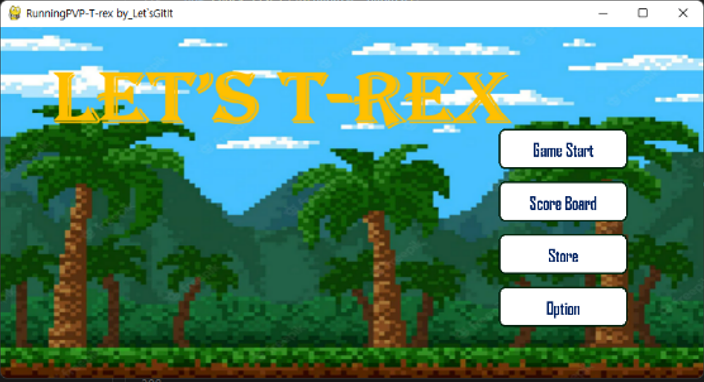
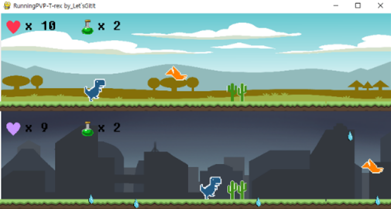
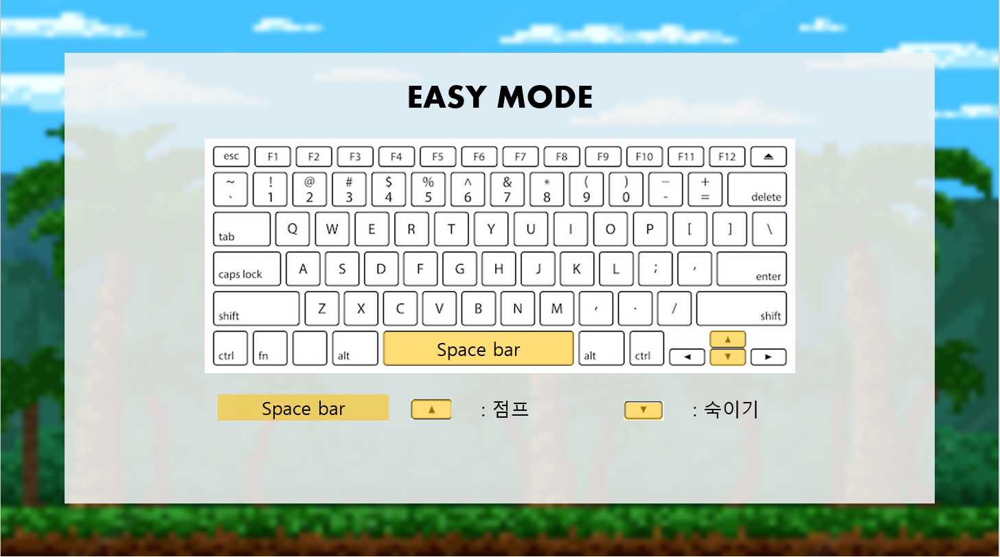
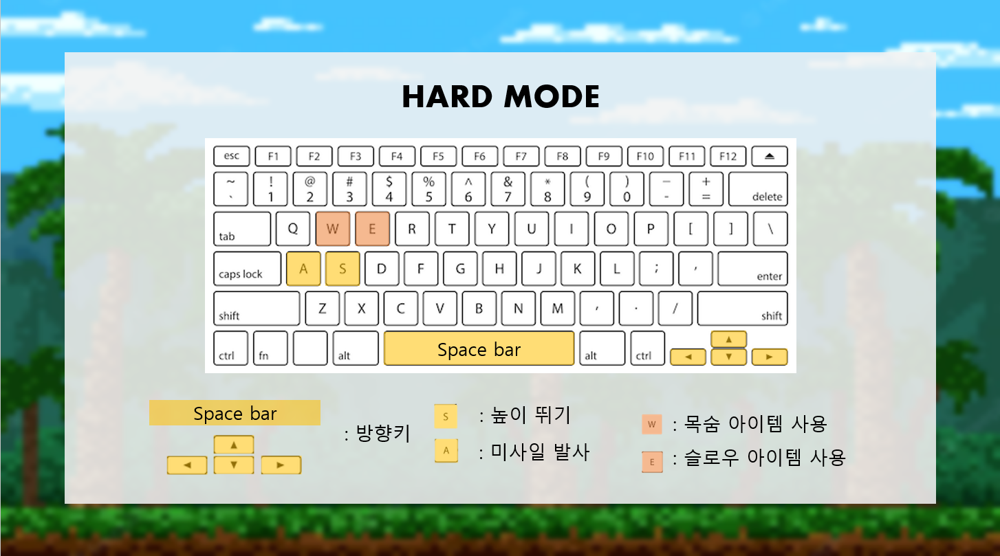
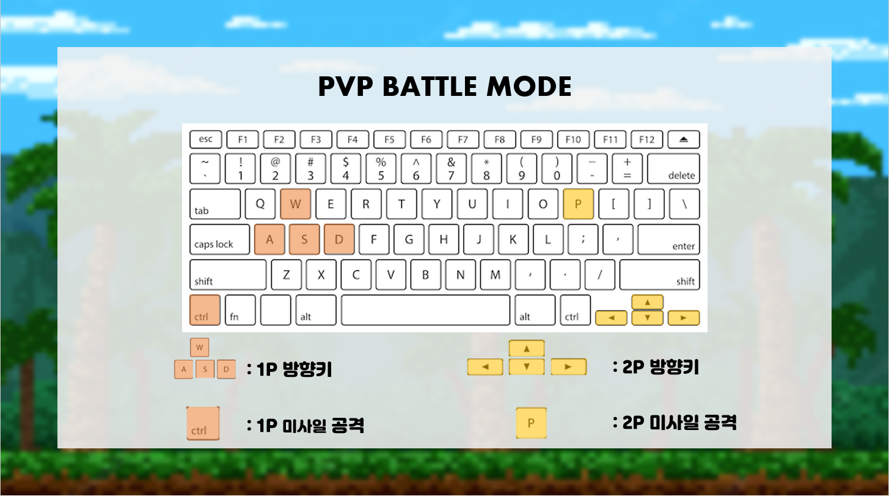
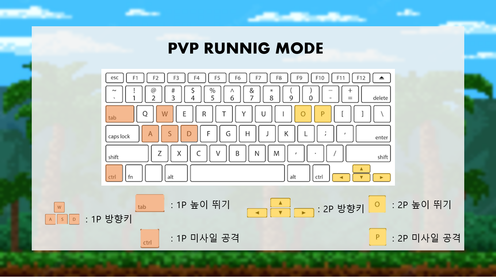

   <br>


# 2022-2-OSSProj-Let-sGitIt-6

## 팀원 : 정재혁 송영철 김재홍
---

# 프로젝트 제목 : 오픈소스를 활용한 T-Rex Rush 게임 개발:
<center>
    <div style = "padding: 10px 1px 2px 10px;">
        
        
    </div>
</center>

<br>
# 프로젝트 내용 : <br>
🦕 Chrome 이스터에그 게임 T-rex Rush에 다양한 모션, 공격기능, PVP BATTLE모드, PVP RUNNING모드 상점 기능을 추가하여 흥미를 더한 게임

<br>


## Major Change
- Intro Screen 디자인 변경 및 GUI 버그 수정
- PVP battle모드 추가 및 개선
- PVP running모드 개발
- 상점 기능 추가
- 목숨 시스템을 count로 변경
- HARD모드 아이템 및 오류 수정
- 리사이즈 개선
- 신기록 페이지 추가

<br>


## SETTING TO PLAY GAME
```
Python version 3.7
```

## TO INSTALL THIS GAME
```
 git clone https://github.com/CSID-DGU/2022-2-OSSProj-Let-sGitIt-6.git
```
## TO RUN THIS GAME
```
pip install pygame
python run.py
```
<br>

## How to Play
<center>
    <div style = "padding: 10px 1px 2px 10px;">
        
        
        
        
        
        
    </div>
</center>
<br>
<br>

## Developed by:
### CSID-DGU - "Let's Git It"

 🦖 [JAEHYUK](https://github.com/jaehyukjung)      🦖 [JAEHONG](https://github.com/MealWithoutSoup)    🦖 [YOUNGCHUL](https://github.com/Song-YoungChul)

### CONTACT US
[JAEHYUK] : wjdwogur9@naver.com <br>
[JAEHONG] : asdr111324@gmail.com <br>
[YOUNGCHUL]: syc5002@naver.com <br>

[게임시연영상] : https://www.youtube.com/watch?v=C-1JHc5rf5M<br>

 <br>

 ## Credits:
- __Sprites__ : https://chromedino.com/assets/offline-sprite-2x-black.png or '2021-1-MilkDragon' made
- __Obstacle__ :
  - __Snowman__ : Snowman by Michael J Pierce @ IsometricRobot.com
  - __Pumpkin__ : Copyright © 2018 TheGoatIsBetter under license CC-BY-SA 4.0 All Rights Reserved
  - __Tree__ : https://opengameart.org/content/lpc-modified-art <br>  https://opengameart.org/content/lpc-plant-repack <br> https://opengameart.org/content/lpc-all-seasons-apple-tree
- __Items__ :
  - __Ice__ : https://opengameart.org/content/snow-flake
  - __Potion__ : http://pixelartmaker.com/art/5484d0007d98bb9
- __Character__ : https://opengameart.org/content/tux-kyrodian-legends-style
- __Logo__ : https://textcraft.net/
- __Sounds__ : https://github.com/vicboma1/T-Rex-Game/tree/master/Unity/Sounds

- __PVP Skin__ : Copyright/Attribution Notice: Original is by Hyptosis, under a CC0 license.

<br>

## References:
- http://www.pygame.org/docs
- https://github.com/wayou/t-rex-runner
- https://github.com/shivamshekhar/Chrome-T-Rex-Rush
- https://opengameart.org/content/tux-kyrodian-legends-style
- https://github.com/CSID-DGU/2021-1-OSSPC-MilkDragon-6
- https://github.com/CSID-DGU/2021-2-OSSProj-TwoSeokTwoJoo-3
- https://github.com/CSID-DGU/2022-1-OSSProj-JiwooKids-5
